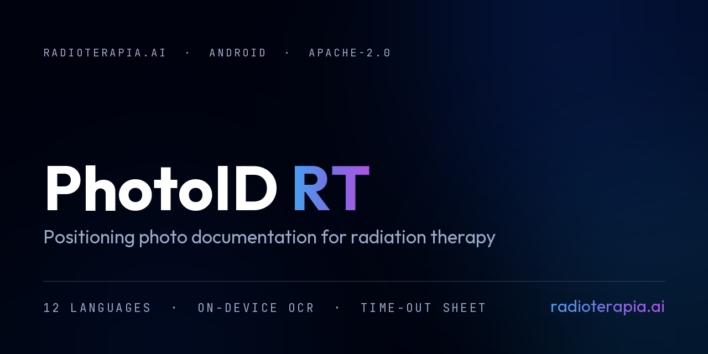
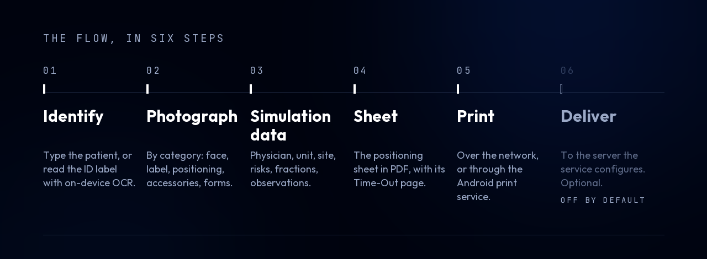

<p align="center">
  
</p>

# PhotoID RT

> **Support tool. Not validated for clinical use.**
> This is not a medical device. It does not diagnose, does not measure, does not
> interpret medical images, and does not replace professional judgement. Fields
> filled in by label or barcode reading are **suggestions** and require human
> confirmation. The printed sheet is a document belonging to the team that
> issued it. See [NOTICE](NOTICE).

Part of the **[Radioterapia.AI](https://radioterapia.ai)** **mobile** ecosystem.
Positioning photo documentation for radiation therapy, on Android tablets used
inside the simulation room and at the treatment unit.

The ecosystem is kept in three deliberately separate layers: **mobile**, the
tablet apps used at the machine — this one; **local**, the tools that run on a
Windows workstation; and **web**, the AI-first agents and the hub. They share a
name and a clinical posture, not a codebase: nothing here depends on the other
two, and nothing here talks to them.

---

## The problem it solves

In many services the positioning record is taken on the phone of whoever happens
to be in the room, and the sheet is filled in by hand afterwards. The photos get
lost, or live on someone's personal device, or arrive on the first treatment day
with nobody sure which patient they belong to.

PhotoID RT runs on a tablet inside the room. It identifies the patient, organises
the photographs by category — face, ID label, positioning, immobilization
accessories, printed forms — builds the positioning sheet with its **Time-Out**
page, and prints it. In the **Treatment** module the same photographs are
consulted day by day to check the patient's setup.

The flow:

<p align="center">
  
</p>

1. **Identify the patient** — type it, or read the ID label with on-device OCR
   and barcode scanning.
2. **Photograph**, by category.
3. **Fill in the simulation data** — physician, treatment unit, site, risks,
   observations, planned number of fractions.
4. **Generate the positioning sheet** in PDF, with the Time-Out page.
5. **Print it**, over the network or through the Android print service.
6. **Optionally, let the tablet deliver the files** to the service's own server.
   Off by default — see [Delivering the files](#delivering-the-files).

## What is ours, and what is not

**The recognition models are not ours.** Text recognition and barcode reading are
performed by **Google ML Kit**, a third-party component. We did not develop it
and we claim no authorship over it.

What this project builds is the **accessibility layer**: the interface that puts
existing capability within reach of the people working in the room. Ours are the
categorised capture flow, the on-disk organisation, the positioning sheet and its
Time-Out page, and the heuristics that interpret text ML Kit has *already*
recognised (`scan/EtiquetaParser.kt`).

Making something reachable is not a neutral act — it is what turns "available
library" into "used in the clinic". That is why the warnings, and the human
confirmation designed into every suggested field, are our responsibility.

The full component list, with authorship, licence and version, is in
[NOTICE](NOTICE), in [THIRD_PARTY.md](THIRD_PARTY.md), and in the app's own
**Settings → About** screen.

## Two regimes, the same code

They are not the same thing, and the difference is who deploys it and for what.

| | Published code | An institution's own build |
|---|---|---|
| What it is | Teaching and research material | In-house SaMD |
| Medical device? | **No.** Not validated for clinical use | With documented validation and record retention |
| Who answers for it | Whoever downloads, modifies and deploys answers for their own build | The service that deploys it |

The precedent is TotalSegmentator itself: it declares that it is not a medical
device and is not intended for clinical use, and it is a certified component
inside FDA-cleared products.

## Why the APK is 75 MB

About 57 MB of it is the ML Kit recognition engine, in four ABIs.

That size is not overhead to apologise for — **it is the physical evidence that
nothing leaves the tablet.** The app reads a patient's ID label without sending
the image anywhere. Recognition happens on the device, and for that to be true
the model has to live on the device.

## Privacy

- **Photographs of patients are personal data**, and a facial photograph tied to
  a medical record number is biometric data. The healthcare institution is the
  controller; the app is a tool it operates under its own responsibility.
- **A check in the validation ritual fails the build when a network primitive
  appears in a file that is not on the list.** The list has nine entries —
  network printing, SMB, patient-list sync, treatment photo retrieval, the four
  synchronization adapters, and the update check. It doubled in 4.0 and grew by
  one in 4.4, which is exactly what the check is for: adding network to this app
  takes an explicit edit that shows up in the diff and goes to review. The risk
  was never what the app does; it was a library added tomorrow reaching the
  internet without anyone deciding.
- **Eight of those nine go to an address the institution provides.** The ninth,
  the update check, is the only one that contacts an address *we* chose — the
  project's public repository. It sends an HTTPS request and nothing else: no
  patient data, no device identifier, no usage statistics. There is no account
  and no telemetry, so the app does not know who is asking and the answer is the
  same for everyone. See [Updates](#updates).
- Images leave the device only to somewhere the service chose: network printing,
  a USB drive, a synchronization app it installed, or the built-in
  synchronization it configured and enabled. Every destination is an address the
  institution itself provides.
- **Where that address points is the institution's decision, and it has
  consequences.** Pointed at a server on its own network, nothing crosses a
  border. Pointed at a cloud service, the files come to be stored where that
  service stores them, under that service's terms. The Privacy Policy inside the
  app says this in those words, in all twelve languages — it used to say
  "there is no international transfer", which stopped being true the moment the
  cloud destination existed.
- Photographs are stored in shared storage at `PhotoID_RT/PHOTOS/`, so the
  tablet's gallery can see them. When "All files access" is not granted, the app
  falls back to its private folder — **and says so on screen**, because Android
  deletes that folder on uninstall.
- **No real data, not even sample data, enters this repository** — no patient
  CSV, no DICOM series, no log carrying an identifier. `*.csv`, `*.xlsx`,
  `*.xlsb` and `*.dcm` are in `.gitignore` as a second barrier, not as
  permission. To test the patient-list import, use invented data.

## Delivering the files

The photographs and the PDF are written to the tablet's shared storage. Getting
them to the service's server is a separate problem, and the app offers two
answers to it.

**The one that has always been there:** point any synchronization app
and the like — at the `PhotoID_RT` folder. The app does nothing; the folder is
just a folder.

**The one added in 4.0:** the app delivers them itself, to destinations the
service configures — an SMB file server, WebDAV, FTP, SFTP, or a folder in a
cloud app already installed on the tablet (through the Android document picker,
so no credential of that cloud ever passes through this app).

It is **off by default, and that is not a formality.** With the master switch
off there is no background service, no connection attempt, and nothing leaves
the device — the behaviour is exactly what it was before the feature existed. A
service that updates the app does not silently start shipping patient
photographs somewhere.

Two properties that are part of the design, not of the current implementation:

- **One way, and it never deletes.** The app writes at the destination. It does
  not remove, does not rename, and does not bring anything back. This is what
  separates a backup from a mirror, and a mirror of patient data means an
  accidental deletion on the tablet erases the institution's copy.
- **Credentials never leave the device.** They live in `EncryptedSharedPreferences`
  under an Android Keystore master key, and they are deliberately excluded from
  the configuration transfer package — which travels by e-mail and on USB drives.

There is no destination of ours anywhere in this. The app has no server, and the
authors receive no copy.

## Languages

Twelve, all complete: Portuguese, English, Spanish, French, German, Italian,
Polish, Chinese, Japanese, Korean, Arabic and Bengali. Arabic renders
right-to-left.

The app opens in the **device's language** when it is one of the twelve, and in
**English** otherwise. It can be changed at any time in Settings — that choice
then wins over the device.

## Install

Download the APK from the
[Releases](https://github.com/radioterapia-ai/photoid-rt/releases) page and
install it on the tablet. Android will ask you to allow installation from this
source.

Permanent link to the latest version:

```
https://github.com/radioterapia-ai/photoid-rt/releases/latest/download/PhotoID_RT_LATEST.apk
```

Every release publishes a `SHA256.txt`. Check it before installing:

```
certutil -hashfile PhotoID_RT_LATEST.apk SHA256
```

**Requirements:** Android 7.0 (API 24) or later. Built and used on a Galaxy Tab S6.

### The step that must not be skipped

After installing, grant **All files access**: Settings → Apps → PhotoID RT →
Permissions → Files and media → **Allow management of all files**.

With it, photographs and PDFs go to `PhotoID_RT/PHOTOS/` in shared storage, the
tablet gallery can see them, any synchronization app can reach them, and they
**survive uninstalling the app**. Without it everything falls into the app's
private folder, which Android **deletes on uninstall** — the app says so on
screen rather than failing quietly, but the warning is easy to dismiss.

To confirm the tablet is running the build you think it is: Settings → About
inside the app shows version and build number, and they must match the release
you installed.

## Updates

From 4.4 the app can tell you when a newer version exists. **Settings → App
update** has two buttons: *Check for update* asks the repository now, and *Update
now* downloads, verifies and hands the file to the Android installer.

It also checks on its own — at startup and after a successful synchronization, at
most once every six hours — and marks the settings gear with a red dot when it
finds something. This is on by default and can be switched off in the same
screen.

**Nothing is reported when there is no internet.** Tablets in a radiotherapy
department usually live on an internal network with no route out, so a failed
check is the expected state, not an error; warning about it would only train the
team to ignore warnings. The manual *Check for update* button does report
failure, because there a human asked and silence would look like a broken button.

What it actually does:

1. Reads a small `version.json` from the release permanent link. Not the GitHub
   API — that limits unauthenticated requests per IP, and a whole department
   leaves through one IP, so twenty tablets behind the same NAT would exhaust the
   quota and the check would start failing silently.
2. Compares by `versionCode`, never by name. `"4.10" < "4.9"` in text order, and
   that is how a version check stops working exactly when a project passes its
   ninth minor release. The published `minSdk` is part of the comparison, so a
   tablet is never invited to install something it cannot run.
3. Before installing, saves a copy of the patient records and settings **on the
   device**. That copy never leaves it and contains no password. It is small
   because an APK update cannot touch the photographs — they live in shared
   storage, and the Time-Out and observation files sit beside them.
4. Downloads the APK, checks its SHA-256 against the published value, and only
   then hands it to the Android installer, **which asks you to confirm**. An app
   that is not a system app and not a device owner cannot install silently, and
   this one does not try.

Installing this way needs `REQUEST_INSTALL_PACKAGES` and a one-time system
permission for PhotoID RT. The app asks for that permission *before* downloading,
so a missing permission does not waste the department's bandwidth.

## Build your own

Nothing here depends on our machine. You need:

- **JDK 17 to 21.** The JBR 25 bundled with Android Studio **will not do**:
  Gradle 8.13 fails on it with `Type T not present`, which does not look like a
  JDK error.
- **Android SDK** with platform 34.
- Git.

Point at the SDK by creating `local.properties` in the root (it is not
versioned):

```
sdk.dir=C\:\\path\\to\\Android\\Sdk
```

Run the quality gate — tests and lint in one command:

```
./gradlew check
```

`check` treats `MissingTranslation` and `ExtraTranslation` as **errors**: a
missing or surplus string in any of the twelve languages fails the build. That is
the safety net, not an obstacle. On Windows, `tools\portao.cmd` finds the JDK for
you.

Build the APK and assemble the versioned delivery:

```
tools\empacotar.cmd
```

### Signing

Release signing reads a properties file whose path comes from one of two places,
in this order:

1. the Gradle property `photoidKeystore`, in `~/.gradle/gradle.properties`;
2. the environment variable `PHOTOID_RT_KEYSTORE`, for CI.

The order is not arbitrary. `System.getenv()` inside the build reads the
environment of the Gradle **daemon**, which is already running and does not
inherit a variable created after it started — a release once came out unsigned
because of that, and nothing looked wrong. A Gradle property always reaches the
daemon.

```
storeFile=/path/to/your.jks
storePassword=…
keyAlias=…
keyPassword=…
```

Use forward slashes in `storeFile`, even on Windows: in a `.properties` file the
backslash is an escape character.

**Without a key the build does not break.** `assembleRelease` produces
`app-release-unsigned.apk` — visible in the name, and it does not install. That
is deliberate: falling back to debug signing would hand you a different binary
under the usual name. You do not need our key to compile, and it does not travel
with this repository.

If you publish your own build, generate your own keystore. Note that Android
compares certificates on update: a build signed with a different key will not
install over an existing one.

## Before touching the code

**Run `./gradlew check` before and after.** It runs the unit tests and lint
together — 180 tests across the two variants, and lint with
`MissingTranslation` and `ExtraTranslation` as **errors**, so a missing or
surplus translation fails the build. That is the safety net, not an obstacle.
`assembleDebug` does **not** run lint; a green `assembleDebug` proves nothing
about the strings.

Four things in this codebase have cost real builds, and each one fails in a way
that does not point at its own cause:

- **`catch (Exception)` does not catch a missing API.** Calling a method that
  does not exist on the running Android version throws `NoSuchMethodError`,
  which is an `Error`, not an `Exception` — the `try/catch` around it does not
  protect anything and the app closes. With `minSdk 24`, every `NewApi` lint
  error is a potential crash: guard with `Build.VERSION.SDK_INT`, never with
  `try/catch`. This exact mistake took down photo capture on API 24–29 tablets,
  in both camera screens, behind a `catch (_: Exception) {}` that looked safe.
- **`obtainStyledAttributes` needs the `int[]` sorted.** Building the attribute
  array by hand compiles and runs, but if the IDs are not in ascending order it
  returns the **wrong attribute**, silently. Use `declare-styleable` and let
  AAPT generate the array.
- **A View touched on `Dispatchers.IO` throws.** Capture everything that comes
  from the UI *before* the `launch`.
- **`.cmd` and `.bat` must be CRLF.** `cmd.exe` reads batch files by byte
  offset; with LF it loses its place and starts executing the remainder as
  prompt commands. It breaks `if (...)` blocks and `goto :label` first, so a
  linear script survives — which leaves the trap dormant until someone adds a
  block. `.gitattributes` carries `*.cmd text eol=crlf` for exactly this, and a
  global `* text=auto eol=lf` without that line breaks the installer in any
  clone.

Storage conventions are load-bearing: patient folders are `NAME - RECORD`,
resolved only through `StorageLocal.resolverPastaSim()`, never by concatenating
strings. Re-irradiation reuses the patient folder with a `NOVA SIMULACAO n`
suffix. Changing any of this breaks installations already in the field.

## Project layout

```
app/src/main/java/com/radioterapia/ai/
├── MainActivity.kt                 simulation camera, identification
├── HomeActivity.kt                 entry point (Simulation / Treatment)
├── BaseActivity.kt                 shared toolbar and all printing logic
├── audit/AuditLogger.kt            audit log (rotated by day)
├── consent/ConsentActivity.kt
├── crop/CropActivity.kt            16:9 crop, pinch to fit
├── i18n/LocaleManager.kt           the twelve languages, and which one opens
├── patient/PatientCache.kt         patient records — key NAME | RECORD
├── pdf/PdfBuilder.kt               positioning sheet + Time-Out page
├── protocolo/                      service-specific final pages
├── quality/PhotoQualityDetector.kt dark / bright / blurred
├── rubricario/                     signature register, in named team blocks
├── scan/                           label reading (OCR by ML Kit)
├── session/SessionManager.kt       session and draft
├── sync/                           optional one-way delivery (off by default)
│   ├── MotorSync.kt                incremental scan, sent-index, time budget
│   ├── SyncWorker.kt               WorkManager: schedule and triggers
│   ├── LogConexao.kt               the connection report, made to be pasted
│   └── destino/                    SMB, WebDAV, FTP, SFTP, SAF
├── transfer/PacoteConfig.kt        export/import configuration, item by item
├── treatment/                      Treatment module (carousel, extra photos)
├── ui/                             Finish, Edit record, Edit simulation,
│                                   History, Settings, Logs, About
├── update/                         version check and in-app update
│   ├── AtualizacaoRemota.kt        the only new file that touches the network
│   ├── GerenciadorAtualizacao.kt   the decisions — no network, so testable
│   └── BackupPreAtualizacao.kt     records and settings copied before installing
├── util/                           DateUtils, StorageLocal, stores
└── wizard/WizardActivity.kt        first run
```

## Known technical debt

- Around 160 Portuguese messages remain in code with interpolation
  (`"Error: $message"`). Extracting them means converting to resources with
  format arguments — mechanical work that changes many signatures at once.
- A few fixed texts remain in layouts: abbreviations, symbols and example
  values. `HardcodedText` stays as a lint warning because of them.
- `MANAGE_EXTERNAL_STORAGE` in the manifest would require formal justification
  if the app ever went to the Play Store. It is why photographs can live in
  shared storage where the clinic's sync tool can reach them.
- `PatientCache` keeps everything in a single JSON.

## Reporting a problem

Include: package version, tablet model, screen orientation, language, and — when
it involves the PDF — whether the physical label is enabled and at what
dimensions. Screenshots help a great deal.

Security issues: please see [SECURITY.md](SECURITY.md) and use private
vulnerability reporting rather than a public issue.

## Security

Found something that exposes patient files, signing keys or credentials? **Do
not open a public issue.** Use GitHub's private vulnerability reporting on this
repository, described in [SECURITY.md](SECURITY.md).

## How to cite

[CITATION.cff](CITATION.cff) carries the machine-readable citation; GitHub
renders a "Cite this repository" button from it.

## Licence and name

The source code is released under the **[Apache License 2.0](LICENSE)**.

Two things travel with it and are not optional:

- **[NOTICE](NOTICE)** — section 4(d) of the licence requires it to accompany
  every redistribution. It carries the third-party credits and the declaration
  that this is not validated for clinical use. It is the same thing we ask of
  ourselves toward the components we use.
- **The name is not licensed.** Section 6 grants no trademark rights:
  "Radioterapia.AI" and "PhotoID RT", and their logos, may not be used to
  identify derived products. [TRADEMARK.md](TRADEMARK.md) also states plainly
  what a fork *may* keep — including the package namespace.

Copyright © 2026 Henrique Faria Braga. Radioterapia.AI is a trade name and a
website, not a legal entity.

If this work is useful in yours, a citation is appreciated — see
[CITATION.cff](CITATION.cff). It is asked for, not required.

Learn more at **[radioterapia.ai](https://radioterapia.ai)**.
